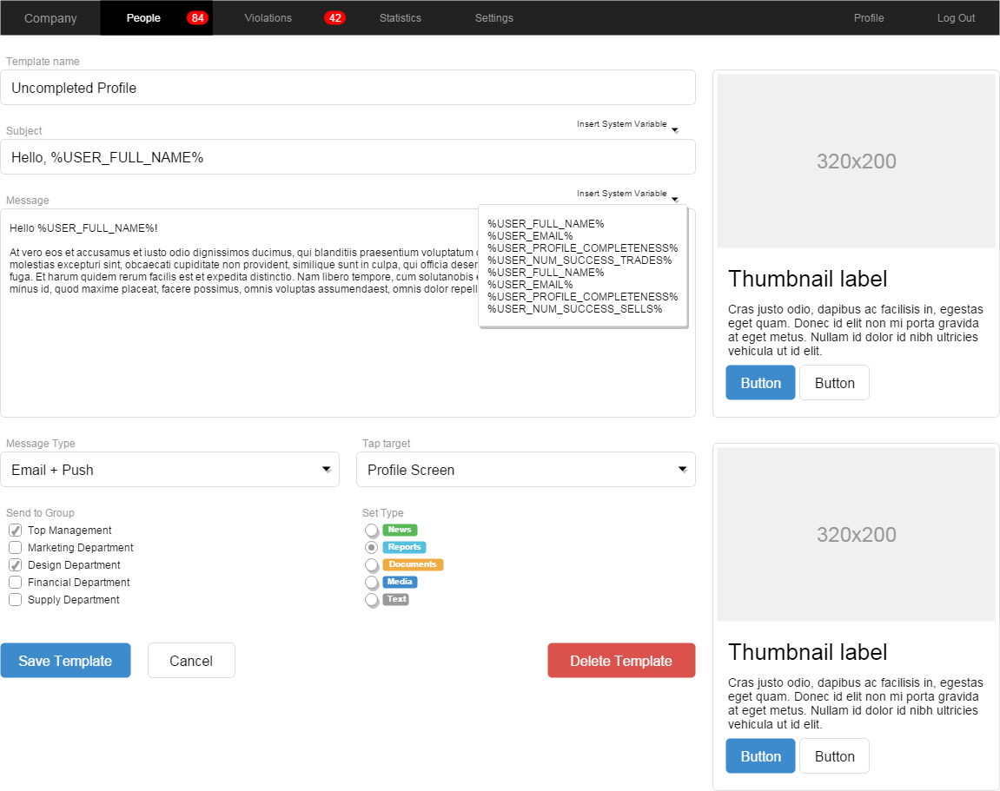
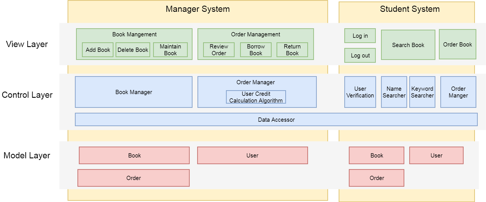
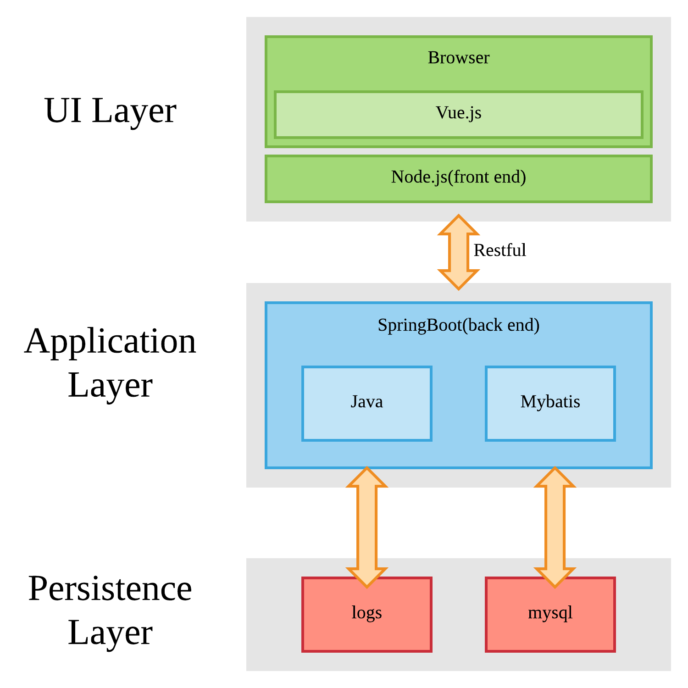
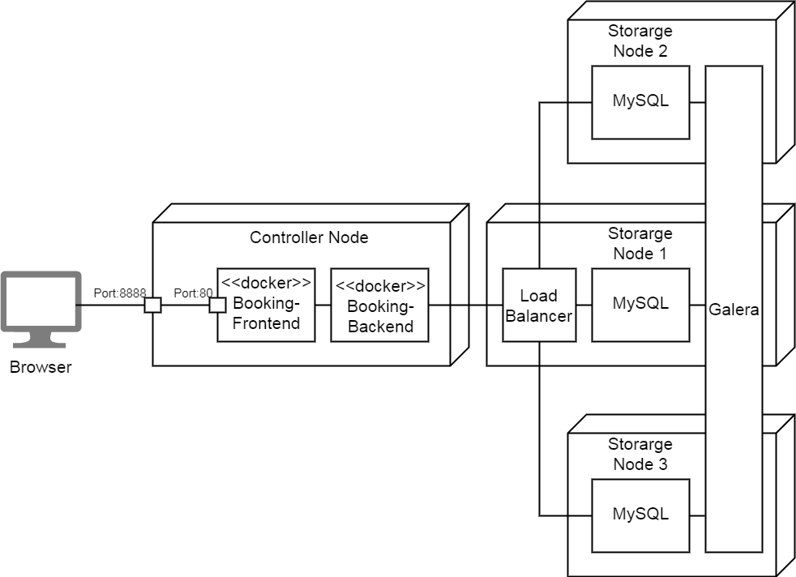
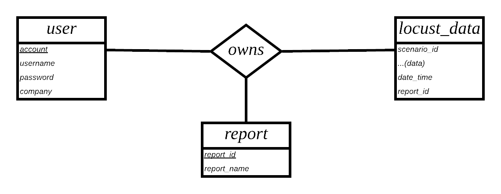

# High-level Design (概要设计规约)

## Prototype Design (原型设计)

The UI design of the project, add some mockups here. Here is a sample drawn by draw.io:



## Business Architecture (业务架构)

The business architecture outline the key components in each layers of the project systems. Here is a sample:




## Technology Architecture (技术架构)

The architecture of the technology stacks (coding language, frameworks, libraries, styles, etc) used in the project. Here gives an example:



## Deployment Topology (部署结构)

Deployment Topology shows how the whole project is deployed in the physical environment, including servers, VMs/containers, networks, key components, etc. A overview picture is required to show the topology. Here is a sample picture of Deployment Topology:



## Data Models 

### Entity-Relation Design 

A ternary relationship between table user,locust_data and report.



### Database Design 

**Table: user**

_Contains information of users._

| Column | Type | Description |
|:---:|:---:|:---|
| account | varchar(255) | primary key, identifier |
| username | varchar(255) | name of the user |
| password | varchar(255) | password of the user |
| company | varchar(255) | company infomation |

**Table: owns**

_Relationship set used to correlate three tables._

|  Column   |     Type     | Description                             |
| :-------: | :----------: | :-------------------------------------- |
|  account  | varchar(255) | foreign key references user.account     |
| report_id |   int(11)    | foreign key references report.report_id |

**Table: report**

_Stores attributes of reports._

|   Column    |     Type     |    Description     |
| :---------: | :----------: | :----------------: |
|  report_id  |   int(11)    |    primary key     |
| report_name | varchar(255) | name of the report |

**Table:locust_data**

_Collects data from locust testings._

|        Column         |   Type   |               Description               |
| :-------------------: | :------: | :-------------------------------------: |
|      scenario_id      | int(11)  |           id of the scenario            |
|       requests        | int(11)  |           total requests sent           |
|       failures        | int(11)  |             total failures              |
| median_response_time  | int(11)  |         median time of response         |
| average_response_time | int(11)  |        average time of response         |
|   min_response_time   | int(11)  |        minimum time of response         |
|   max_response_time   | int(11)  |        maximum time of response         |
| average_content_size  | int(11)  |          average content size           |
|  request_per_second   | int(11)  |           request per second            |
|       date_time       | datetime |       receive time of this record       |
|       report_id       | int(11)  | foreign key references report.report_id |

## Interface Specifications （接口规约）

The specifications of interfaces used in interactions among subsystems, here gives a RESTful example in the style of [Swagger](https://swagger.io/):

---
### *customer/name*   

#### Description (接口描述)

Get the name of a customer.

| | |
|-|-|
| Request Method | Get |
| Authorization | Required |


#### Parameters (参数)

| Name | Located in | Description | Required | Schema |
|:-:|:-:|:-|:-:|:-|
| id | query | customer id | Yes | number(double) |

#### Responses (返回结果)

| Code | Description | Schema |
|:----:|:--------|:--|
| 200 | Successful response | *name* : string |

#### Request Sample (示例请求)

```
customer/name?userId=214
```

#### Response Sample (示例结果)

```
{

  "name" : "Kanglin Yin"

}

```
---