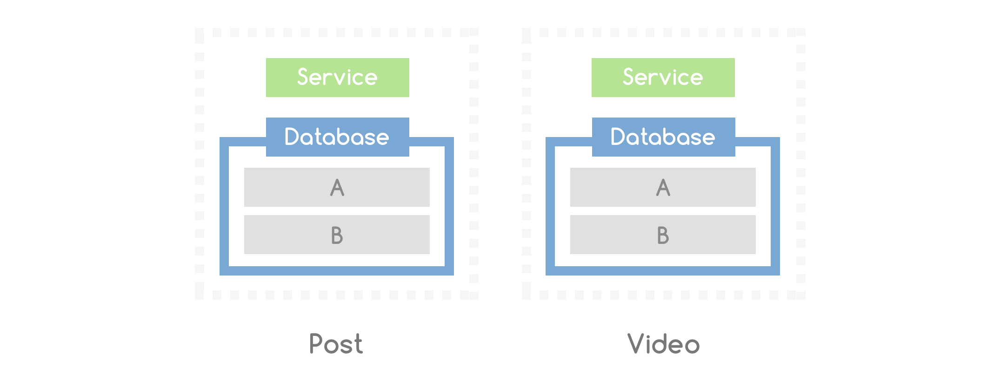
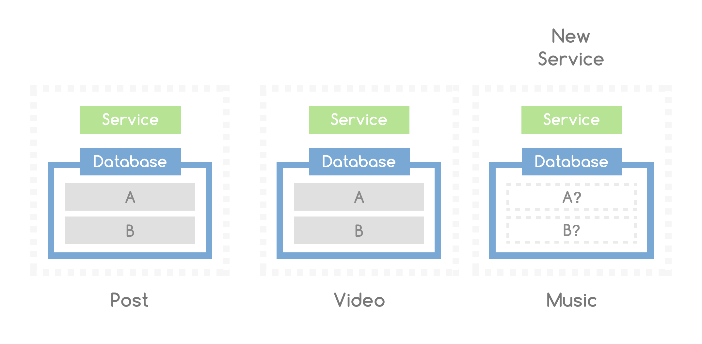
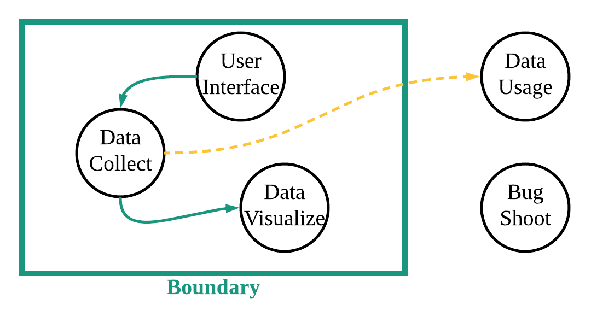
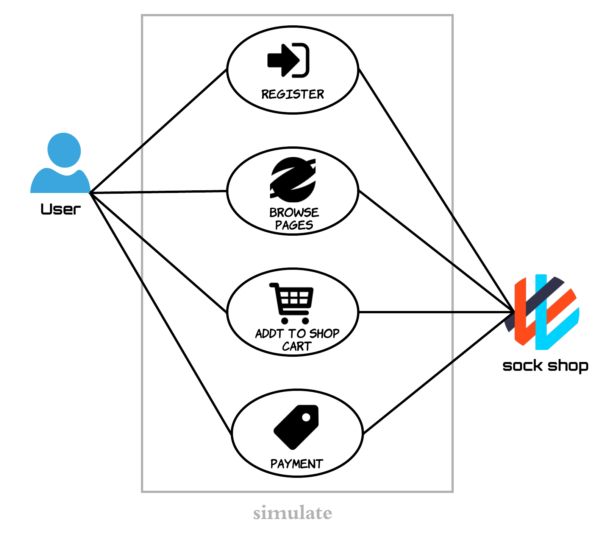

# Requirement Specification (需求规约)

## Project Introduction (项目介绍)

#### background(背景介绍)

_**微服务定义**_

- 一种软件开发的技术

- 一个SOA(面向服务架构)的变体

- 一系列松散耦合的服务的集合

**缺点**:测试和部署较为困难

下图演示了各个微服务模块的独立性：

图中每一个微服务模块都有自己的数据库

_**测试工具**_

Locust

_**测试网站**_

SockShop 

#### purpose of the project(项目用途)

本项目旨在构建一套完整的接口，运用Locust压测工具对基于微服务架构搭建的网站Sock Shop中提供的各类API进行压力测试，并收集测试数据和记录图表。

#### target users(目标用户)

- 微服务网站建设团队
- 软件测试工作人员
- 深度学习研究和数据使用者

#### boundary of the project (项目边界)

## Rquirement Analysis (项目需求分析)

## Use Case Analysis (用例分析)

---

### _Register（注册）_

#### Description

此用例模拟用户注册某网站的场景

#### Participants

用户，网站服务器

#### Post-condition 

用户注册成功并使用此新用户名登陆网站

#### Process Flow

用户输入注册用户名密码以及其他可选信息，点击register按钮

#### Exceptions 

输入的用户名已被注册，提示error(在测试结果中显示为Failure)

### _Browse Pages（浏览网页）_

#### Description

此用例模拟用户浏览网页的场景

#### Participants

用户，网站服务器

#### Process Flow

用户按照先后次序依次浏览网站主页，商品种类，购物车等页面

### _Add To Shop Cart（加入购物车）_

#### Description

此用例模拟用户将商品加入购物车的场景

#### Participants

用户，网站服务器

#### Pre-condition 

用户成功登陆此网站

#### Process Flow

用户在商品详细信息页面中点击“加入购物车”按钮

### _Payment（结账）_

#### Description

此用例模拟用户清空购物车结账的场景

#### Participants

用户，网站服务器

#### Pre-condition 

用户成功登陆此网站，且其收货地址和银行卡卡号等付款信息已填写完整

#### Post-condition 

成功结账后显示货物已在运送过程中(Shipped)

#### Process Flow

用户在购物车页面点击“付款”按钮并确认订单

---
