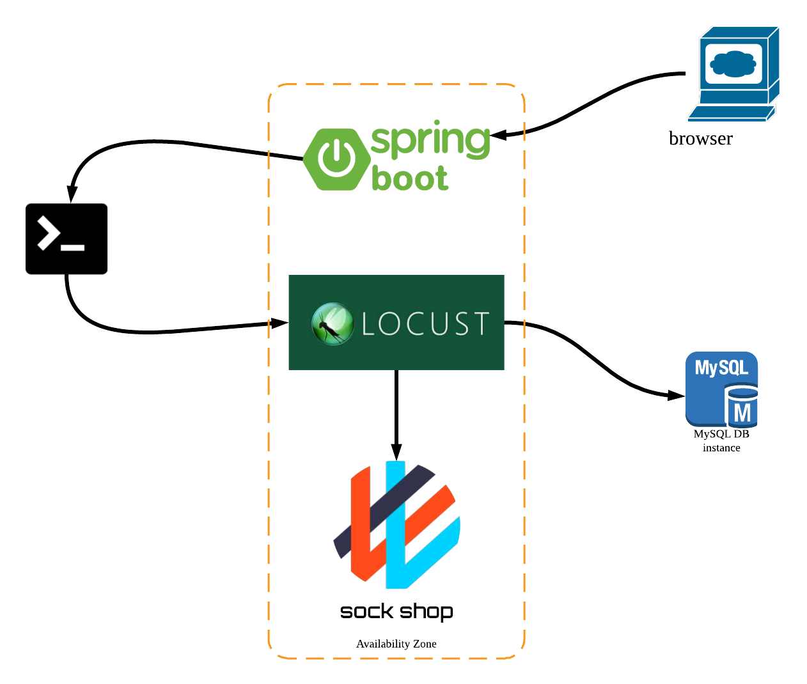
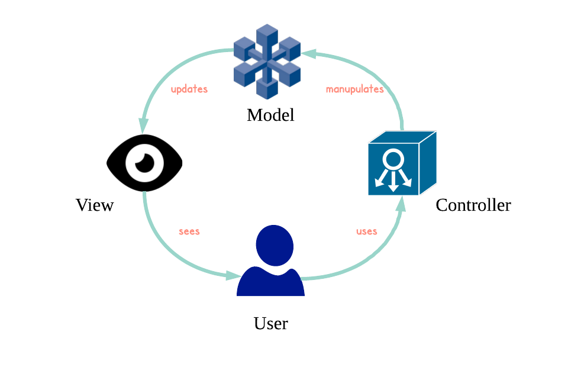
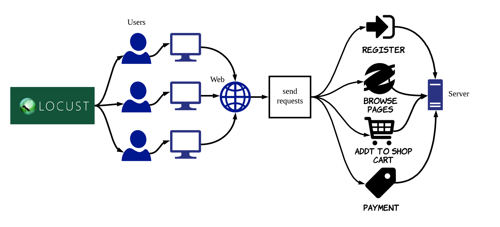

# 微服务APM

​	微服务定义为一种轻量级的应用程序架构，HTTP API通信为其重点。而APM(Application Performance Management)意译为应用性能管理。本项目旨在构建一套完整的接口，运用Locust压测工具对基于微服务架构搭建的网站Sock Shop中提供的各类API进行压力测试，并收集测试数据和记录图表。


### 一、应用架构

#### 1.Sock Shop架构

​	docker-compose


#### 2.本应用架构设计

 



### 二、Java部分

#### １.Spring MVC

 



#### 2.index.html

​	用户输入clients,rate,time,host和task五个选项作为启动Locust的命令行参数。


### 三、python部分

​	python部分代码定义用户行为，locust将按照此行为模拟指定数量和访问间隔的用户，不断测试Sock Shop某个API的功能，反馈成功和失败等的信息。我们模拟了四种普通用户的行为：注册-登陆、浏览网页、加入购物车、结账。

 

#### 1.register

​	register.py文件模拟用户注册Sock Shop的行为。通过random模块的randrange方法随机生成用户名和密码均为四位数的用户。

```python
def register(self):
	rand = random.randrange(1000, 9999, 1)
	self.client.post("/register", \
		json = {"username":str(rand),"password":str(rand),"email":"","firstName":"","lastName":""}, \
		headers = {"Content-Type":"application/json; charset=UTF-8"})
```

​	其中register动作向网站服务器发送的是HTTP POST请求，POST一段包含用户名、密码、邮箱、姓和名的JSON代码，请求成功后网站自动登陆。


#### 2.browsepage

​	browsepage.py文件模拟用户浏览Sock Shop页面的行为，并定义了用户浏览页面的顺序和权重。

```python
class UserBehavior(TaskSequence):
	@seq_task(1)
	def browse_index(self):
		self.client.get("/")
		
	@seq_task(2)
	def browse_catalogue(self):
		self.client.get("/category.html")
```

​	上述代码片段中，TaskSequence类继承了Taskset类，其中的装饰器seq_task()可以规定此用户访问页面的顺序。


#### 3.addtocart

​	addtocart.py文件模拟用户将物品加入购物车的行为。用户首先以用户名密码为addtocart登陆Sock Shop，然后点击页面中某袜子的“Add to cart"按钮。

```python
@task()
def addtocart(self):
	self.client.post("/cart", json = {"id":"03fef6ac-1896-4ce8-bd69-b798f85c6e0b"}, \
				  headers = {"Content-Type":"application/json; charset=UTF-8"})
```

​	上述代码在/cart页面下POST某袜子的id给网站。请求发出后对应id的袜子就被加入用户的购物车了。


#### 4.payment 

​	payment.py模拟用户清空购物车结账的行为，用户首先以用户名密码为payment登陆Sock Shop，然后点击购物车页面中的”Proceed to checkout"按钮。用户的地址和银行卡号已经被预先定义好。

```python
@task()
def payment(self):
	self.client.post("/orders")
```

​	正常的结算流程中用户点击结账按钮并付款后购物车就会被清空，这在Sock Shop的HTTP请求中被分为POST和DELETE两个步骤。由于Locust模拟的是成百上千的用户，如果模拟每一个用户点击结账以后购物车清空，那么下一个用户登陆此账户时必须重新将物品加入购物车，这与我们的测试目的相悖。于是上述代码片段只模拟用户买单的行为，购物车在此之后并不会被清空。


